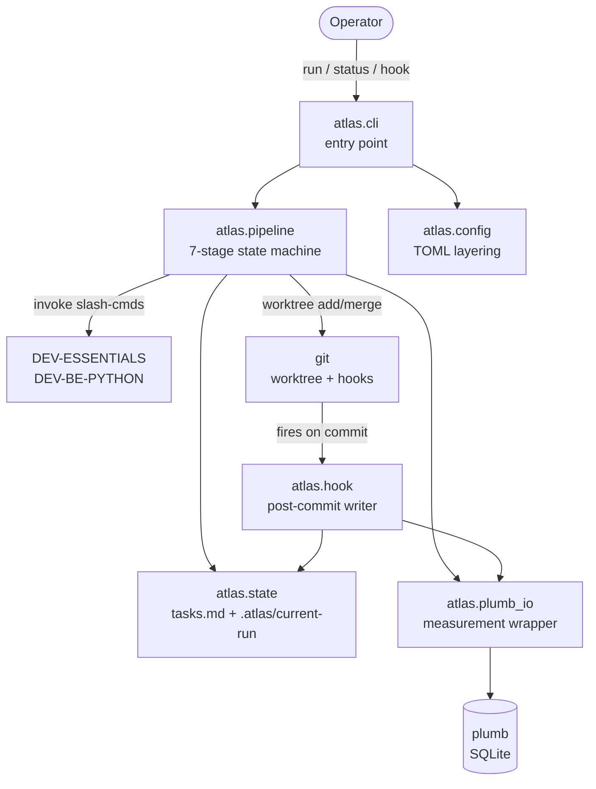
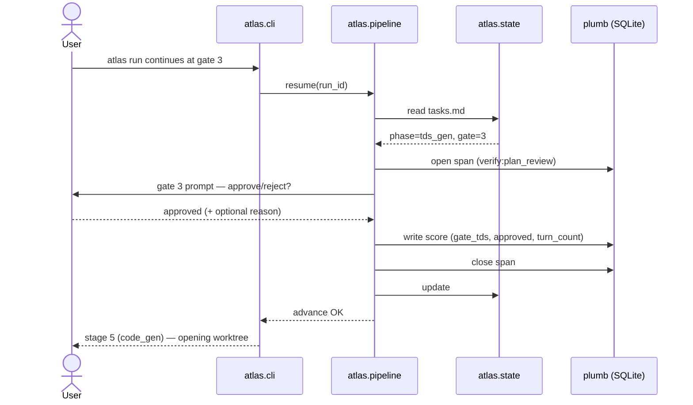

# System Design

> **Status:** v1 architecture finalized 2026-04-24 (Tech Lead pass). Updated
> 2026-07-15 to reflect the v2.0–v2.2 YAML workflow engine (shipped
> 2026-06-30): the hardcoded 7-stage pipeline described below is now one
> workflow (`dev.yaml`) among several, loaded through a generic
> `StageRunner`/`CliBackend` seam. Sections below are annotated where v2
> changed the shape. For the full YAML schema, runner dispatch chain, and
> backend resolution, see
> [`docs/3_guides/yaml_workflow_engine.md`](../3_guides/yaml_workflow_engine.md)
> — that guide is the current source of truth for engine mechanics; this
> document covers architecture-level structure and trade-offs.

## Problem Statement & Requirements

Atlas is a local CLI runtime that walks a human-gated workflow defined in
YAML (the `dev` workflow, by default, encodes the original 7-stage
dev-workflow pipeline), stops at explicit human gates, and writes every
run as a typed span tree into [plumb](https://github.com/anant-gupta-utexas/plumb) —
the measurement spine. As of v2, atlas can run any workflow expressed as a
YAML stage list — not only the dev pipeline — through the same gate
machinery.

The full scope is in [`../1_product_and_research/PRD.md`](../1_product_and_research/PRD.md).
This document covers the *how*: component shape, data flow, boundary
guarantees, and trade-offs.

Key technical challenges:

1. **Surviving session compaction.** The pipeline's state cannot live
   in the agent's chat window; it must be reconstructable from files
   on disk.
2. **Main-branch isolation.** Stage 5 runs code-generation; that code
   must never touch `main` outside of a user-approved merge.
3. **Measurement without instrumentation drift.** Every stage must
   emit exactly one span of the expected kind; gates must write
   exactly one `scorer='user_signal'` row. Partial runs are tolerated;
   silently-missing rows are not.

## High-Level Architecture Overview

```
┌──────────────────────────────────────────────────────────────────┐
│                      atlas CLI (Python)                          │
│                                                                  │
│   atlas run "<task>"   ──▶   State machine                       │
│   atlas status         ──▶   tasks.md reader                     │
│   atlas hook install   ──▶   .git/hooks/post-commit writer       │
│                                                                  │
│   [1] .atlas.toml + ~/.atlas/config.toml        (config merge)   │
│   [2] dev/active/<task>/tasks.md                (canonical state)│
│   [3] .atlas/current-run                        (run_id pointer) │
└────────────────────────────┬─────────────────────────────────────┘
                             │ plumb Python API (direct in-process)
                             ▼
               ┌─────────────────────────────┐
               │   plumb (sibling project)   │
               │   runs / spans / scores /   │
               │   examples    (SQLite)      │
               └─────────────────────────────┘

  external effects (invoked by name, not linked):
    • agent plugins:   DEV-ESSENTIALS, DEV-BE-PYTHON
    • git:             worktree, log, post-commit hook
```

Atlas is a thin state machine plus three files on disk. Everything
interesting — the LLM calls, the measurement storage, the version
control — happens in subprocesses atlas invokes or libraries atlas
imports. Atlas itself owns only:

- Stage ordering.
- Gate prompting.
- `tasks.md` read/write.
- Span start/close + score writes (via plumb's API).
- Worktree create/merge coordination for Stage 5.
- Post-commit hook install/uninstall.

## System Components & Services

> **v2 update:** the diagram and component list below are v1-era (one
> hardcoded pipeline). As of v2.2, `atlas.cli` resolves a workflow through
> `workflow_loader.py` before constructing the pipeline, and stage dispatch
> goes through a `CompositeStageRunner` that routes to `SubprocessStageRunner`
> (plugin commands + `RAW:`, now backed by a `CliBackend` strategy),
> `LibraryStageRunner` (`LIB:`), or `ShellStageRunner` (`SHELL:`) by tool-string
> prefix. `Pipeline` itself is unchanged in shape — it still only sees the
> `StageRunner` Protocol — but it now consumes `tuple[StageSpec, ...]` loaded
> from YAML instead of a hardcoded tuple. See
> [`yaml_workflow_engine.md`](../3_guides/yaml_workflow_engine.md#architecture-overview)
> for the current data-flow diagram covering all five v2 modules.



*(v1-era diagram; `Pipeline` node above now sits behind `workflow_loader.py`
+ `CompositeStageRunner`, see the guide linked above for the current shape.)*

### `atlas.cli` — CLI surface

- `run(task: str)` — inserts a `runs` row, creates
  `dev/active/<slug>/tasks.md`, starts the state machine.
- `status()` — prints `tasks.md`'s `## current` block; exits non-zero
  if no active run.
- `hook install` / `hook uninstall` — writes to / removes from
  `.git/hooks/post-commit` (idempotent).
- **v2:** `run` and `resume` also accept `--workflow <name>` /
  `--workflow-file <path>`, resolved via `workflow_loader.py` before the
  pipeline is constructed. `_make_pipeline()` wires up
  `SubprocessStageRunner`, and conditionally `LibraryStageRunner` /
  `ShellStageRunner`, into a `CompositeStageRunner`.

One command entrypoint registered via `pyproject.toml`.

### `atlas.pipeline` — state machine

- Seven stages for the default `dev` workflow, in order: `research`,
  `prd_draft`, `trd_draft`, `tds_gen`, `plan_review`, `code_gen`,
  `code_review`. **v2:** these are no longer hardcoded — they are loaded
  from `src/atlas/workflows/dev.yaml` via `workflow_loader.py` into the
  same `tuple[StageSpec, ...]` shape `Pipeline` always consumed. Other
  workflows (`job`, `job_cli`, or user-authored YAML) supply their own
  stage tuples through the identical loader path.
- Each stage: open span → invoke tool (or surface prompt for manual
  stages like research) → close span → check gate → either advance
  or pause.
- Gates: hard stops, each a one-line user prompt (approve / reject),
  each writes one `scores` row. Gate score metric names are namespaced
  by workflow (`dev` keeps bare names for backward compatibility; other
  workflows prefix `<workflow>.<gate_label>`).
- No dynamic routing: stage → tool mapping for the `dev` workflow is a
  7-row constant validated against `tests/fixtures/routing_ground_truth.json`
  regardless of whether it's loaded from YAML or (pre-v2) a hardcoded
  tuple — the fixture and its test are dev-workflow-only.

### Runner dispatch (v2) — `CompositeStageRunner` and friends

Added in Phase 2/3 of the v2 build. `Pipeline` is unaware of any of this —
it depends only on the `StageRunner` Protocol.

- **`CompositeStageRunner`** (`composite_runner.py`) — routes each stage by
  its `tool` string prefix: `LIB:` → `LibraryStageRunner`, `SHELL:` →
  `ShellStageRunner`, anything else (plugin commands, `RAW:`) →
  `SubprocessStageRunner`.
- **`SubprocessStageRunner`** (`orchestrator.py`) — the v1 runner,
  generalized in Phase 3 to dispatch through a `CliBackend` strategy
  (`ClaudeCodeBackend` or `AntigravityBackend`) instead of a hardcoded
  `claude -p` argv build. Backend resolution is a 4-tier cascade:
  per-stage YAML → workflow `default_backend` → `.atlas.toml [backend]` →
  hard default `"claude"`.
- **`LibraryStageRunner`** (`library_runner.py`) — dispatches `LIB:` tool
  strings to in-process content-pipeline adapters via a closed registry
  (`atlas/library_adapters/`). Used by the `job` workflow.
- **`ShellStageRunner`** (`shell_runner.py`) — dispatches `SHELL:` tool
  strings as direct list-form subprocesses against an allow-listed set of
  binaries. Used by the `job_cli` workflow (the dependency-free variant of
  `job`).

Full schema, dispatch chain diagram, and error-type tables:
[`yaml_workflow_engine.md`](../3_guides/yaml_workflow_engine.md).

### `atlas.state` — `tasks.md` and `.atlas/current-run`

- Owns the `## current` block format.
- Writes per-stage checkbox sections on run start.
- Updates the `## current` block on gate transitions.
- `.atlas/current-run` holds the active `run_id` for the post-commit
  hook to read.
- Enforces the state-consistency contract: on every `atlas run` /
  `atlas status`, the `run_id` in `.atlas/current-run` must match
  the `run_id` in the referenced `tasks.md` header. Mismatch → exit
  non-zero with a recovery hint naming both values.
- **v2:** the `## current` block gained a `workflow:` field. On resume,
  atlas re-reads this field and re-resolves the workflow YAML through
  `workflow_loader.py` to reconstruct the `StageSpec` tuple. If the YAML
  has since been deleted or edited in a breaking way, resume fails
  loudly rather than silently falling back to `dev`.

### `atlas.hook` — post-commit hook

- Small Python script dropped into `.git/hooks/post-commit`.
- Reads `.atlas/current-run` for the `run_id`, parses the most recent
  `/verify` and `/code-review` stdout captured in the stage 6 span,
  writes two deterministic scores.
- If the commit corresponds to gate 4, writes the `gate_commit`
  user-signal score and flips the state machine.
- Idempotent on the same commit SHA.

### `atlas.config` — TOML layering

- Loads `.atlas.toml` (project) merged over `~/.atlas/config.toml`
  (user default).
- Validates model-routing keys (shape only; v1 exercises one set).
- Returns a single frozen config object consumed by the state machine.

### `atlas.plumb_io` — measurement writes

- Thin wrapper over plumb's decorator + context-manager API.
- Direct in-process calls (resolved 2026-04-24); never touches plumb's
  SQLite directly.
- Pinned to a specific plumb commit SHA in `pyproject.toml`.

## Data Architecture

### Data models (owned by plumb, referenced by atlas)

Atlas does not own a schema. It writes into plumb's four tables:

```mermaid
erDiagram
    runs ||--o{ spans : "has"
    runs ||--o{ scores : "scored by"
    runs ||--o{ examples : "originates"
    spans ||--o{ spans : "parent_of"
    spans ||--o{ scores : "scored by"
    spans ||--o{ examples : "origin span"

    runs {
        id PK
        task string
        status enum
        start_ts timestamp
        end_ts timestamp
        dollar_cost numeric
    }
    spans {
        id PK
        run_id FK
        parent_id FK
        kind enum
        name string
        input_hash string
        start_ts timestamp
        end_ts timestamp
    }
    scores {
        id PK
        span_id FK
        run_id FK
        scorer string
        metric string
        value_label string
        value_numeric numeric
        reason_text string
    }
    examples {
        id PK
        origin_run_id FK
        origin_span_id FK
        input text
        expected_output text
    }
```

Full schema lives in plumb's repo. `runs.kind` is intentionally absent
in v1 (resolved 2026-04-24 — added later as a single column + backfill
to `"dev_workflow"` if a second run kind appears).

### Atlas-owned on-disk state

| File                             | Purpose                               | Owner      | Lifecycle                 |
| -------------------------------- | ------------------------------------- | ---------- | ------------------------- |
| `.atlas.toml`                    | Per-project config                    | User       | Manually authored         |
| `~/.atlas/config.toml`           | User-default config                   | User       | Manually authored         |
| `.atlas/current-run`             | Active `run_id` pointer               | Atlas CLI  | Created on `atlas run`; removed on run close |
| `dev/active/<slug>/tasks.md`     | Canonical pipeline state              | Atlas CLI + user edits allowed | Created on `atlas run`; moved to `dev/archive/` on phase complete |
| `dev/active/<slug>/context.md`   | Session context notes                 | Agent (via `/dev-docs-update`) | Free-form |
| `.git/hooks/post-commit`         | Score-writer hook                     | Atlas CLI (via `hook install`) | Idempotent install/uninstall |
| `.atlas/runs/<run_id>.log`       | Run-scoped log                        | Atlas CLI  | Append-only; no rotation in v1 |

### Data flow (one run)

```
atlas run "X"
  └─▶ insert runs row                 (plumb)
      create dev/active/X/tasks.md    (atlas.state)
      write .atlas/current-run        (atlas.state)
      ├─▶ stage 0: research
      │   └─▶ open span, prompt user, close span
      │       └─▶ gate 0: prompt approve/reject → scores row
      ├─▶ stage 1: prd_draft        (consult-experts PM persona)
      │   └─▶ … same shape …
      ├─▶ … stages 2–4 …
      ├─▶ stage 5: code_gen
      │   └─▶ git worktree add …
      │       invoke code-gen agent inside worktree
      │       (commits inside worktree trigger post-commit hook)
      │         └─▶ post-commit: verify_pass + code_review_finding scores
      │             on gate-4 commit: gate_commit score + advance state
      ├─▶ stage 6: code_review
      │   └─▶ /code-review + /verify
      │       └─▶ gate 5: prompt approve/reject → gate_phase_complete
      └─▶ close runs row (status = success | failure)
```

### Storage strategy

- **Atlas:** flat files only (`*.toml`, `*.md`, `.atlas/current-run`).
  No atlas-owned database.
- **plumb:** single SQLite file at `~/.plumb/plumb.db` (default,
  overridable via TOML).

## API Design

**v1 exposes no network API.** Atlas is a CLI with three commands
(`run`, `status`, `hook install|uninstall`), invoked locally. An HTTP
shell is a v1.1 concern.

Internal "APIs" worth naming:

- **CLI ↔ user.** Each gate is a one-line prompt. Approve/reject + a
  free-form reason line captured as `scores.reason_text` (optional).
- **Atlas ↔ plumb.** Direct in-process Python calls via `atlas.plumb_io`
  (resolved 2026-04-24). No IPC layer in v1; revisited at v1.1 when the
  HTTP shell lands and request lifetimes diverge from plumb writes.
- **Atlas ↔ plugins.** Atlas invokes plugin slash-commands as black
  boxes via `subprocess.run(..., capture_output=True, check=False)`.
  Exit code is the lifecycle signal (resolved 2026-04-24); stdout is
  parsed only for score extraction, not liveness. Each invocation is
  wrapped in a timeout; on timeout / non-zero exit the span closes with
  `status='failure'` and the run halts at the current gate.

### Critical sequence: gate transition (Stage 3 → Stage 4)



The same shape repeats at every gate. The Stage-4 → Stage-5 transition
adds a `git worktree add` between span close and `## current` update;
gate-4 (`gate_commit`) is the only gate written by the post-commit
hook rather than the CLI prompt path.

## Technology Stack

| Layer                  | Choice                        | Rationale                                                                     |
| ---------------------- | ----------------------------- | ----------------------------------------------------------------------------- |
| Language               | Python 3.11+                  | Matches plumb + the rest of the author's backend work; stdlib `tomllib` ships with 3.11. |
| CLI library            | `typer` ≥ 0.12                | Type-hint ergonomics over `click`. If this proves wrong during Day 1, swap is one file. |
| Config                 | `tomllib` (stdlib)            | No runtime dep.                                                               |
| Measurement            | plumb (path install, pinned SHA) | Required dependency; out of scope to fork. Lifted to versioned release at v1.1. |
| Version control        | git ≥ 2.5                     | Needed for `git worktree`; post-commit hook is standard.                     |
| Persistence (atlas)    | Flat files only               | See "Storage strategy" above.                                                 |
| Testing                | `pytest` ≥ 8.0                | Already in the scaffolding.                                                   |
| Lint / type            | `ruff` ≥ 0.4, `mypy` ≥ 1.10   | All three (`ruff check`, `ruff format`, `mypy src`) are CI gates in v1.       |

No databases, no ORMs, no web framework. If atlas grows any of these
in v1, it has drifted from scope.

## Scalability & Performance

Not a v1 concern — single user, single machine, one concurrent run
per repo. Per-stage latency is recorded in `spans.start_ts`/`end_ts`
as data, not as a constraint.

Performance ceilings that *do* matter:

- `atlas status` < 500 ms cold cache (reads one markdown file).
- Post-commit hook < 1 s (longer makes the user's commit flow feel
  broken).

Both targets are spot-checked during the Week 4 real run via `time`;
no continuous perf gate in CI for v1.

## Security Architecture

Restated from PRD §6.4 for completeness:

- **Local-only.** No network listener, no port, no inbound auth.
- **Secrets via env.** LLM API keys come from the user's shell env;
  atlas does not read, persist, or log them.
- **Hook scope.** `atlas hook install` writes only to
  `.git/hooks/post-commit` in the current repo. Never a global hook.
- **Worktree data.** Code generated in the Stage 5 worktree stays in
  the worktree until the user merges. Atlas never pushes, publishes,
  or copies that content.
- **plumb DB path.** Defaults to `~/.plumb/plumb.db` — the user's
  home directory. Configurable via TOML if users want to relocate it
  (e.g. for an encrypted volume).

## Deployment Architecture

- **Dev loop.** `uv sync` → `uv run pytest` → `uv run atlas run …`
  against a sacrificial Flask repo.
- **"Production."** There is no production for v1. The tool runs on
  the author's laptop.
- **CI.** GitHub Actions, manual `workflow_dispatch` only (single-maintainer
  repo): `pytest`, `ruff check`, `mypy src`, and the routing-ground-truth
  fixture test. No deployment step.
- **Release.** No release mechanism in v1 — the repo *is* the
  artifact. A tagged `v1.0` when Week 4 ships and a full end-to-end
  run completes on the real target.

## Trade-offs & Alternatives

1. **State machine vs. agent framework.**
   *Chosen:* hand-rolled state machine in ~300 lines of Python.
   *Rejected:* LangGraph, CrewAI, any multi-agent framework. For a
   deterministic 7-stage pipeline, a framework imports complexity
   the pipeline doesn't use.
2. **plumb via direct Python calls vs. subprocess.**
   *Chosen (2026-04-24):* direct in-process calls. Same author, no
   trust boundary to enforce; subprocess adds serialization overhead
   and a second failure mode the v1 LoC budget can't absorb.
   *Revisit:* v1.1, when the HTTP shell lands — request lifetimes
   and plumb writes diverge in failure semantics, and a boundary
   becomes worth its cost.
3. **Plugin lifecycle: exit code vs. stdout marker vs. polling.**
   *Chosen (2026-04-24):* exit code primary, stdout for score parsing
   only. *Rejected:* sentinel markers (couples atlas to plugin output
   format) and polling (no plugin emits a heartbeat). Each invocation
   wrapped in a timeout to bound the worst case.
4. **Score writing via post-commit hook vs. direct plugin edits.**
   *Chosen:* post-commit hook parses plugin stdout. *Rejected:*
   modifying `DEV-ESSENTIALS` to write scores directly. Keeps the
   plugin unchanged; accepts that parsing is brittle and will break
   if the plugin's output format changes.
5. **Resume protocol via CLAUDE.md instruction vs. `/dev-resume`
   slash command.**
   *Chosen for v1:* instruction paragraph. *Deferred to v2:* slash
   command. The cost of drifting once is low; the cost of building
   the wrong slash command twice is higher.
6. **Stage 5 worktree boundary vs. branch + reset.**
   *Chosen:* `git worktree`. *Rejected:* feature branch on the main
   working tree. Worktree gives a physical directory boundary the
   code-gen agent cannot accidentally escape; feature branches do
   not.
7. **`runs.kind` discriminator now vs. later.**
   *Chosen (2026-04-24):* defer. v1 writes runs without a kind
   column. *Rejected:* speculative schema. Adding later (single
   column + backfill of existing rows to `"dev_workflow"`) is
   cheap; designing for an undefined second kind is not.
8. **`.atlas/current-run` mismatch handling.**
   *Chosen (2026-04-24):* detect, print recovery hint naming both
   `run_id` values, refuse to continue. *Rejected:* automatic
   reconciliation. A silent fix is the failure mode the resume
   protocol is built to avoid.

## Risks & Mitigation

Architectural risks specific to the design (operational risks live
in [`../1_product_and_research/PRD.md`](../1_product_and_research/PRD.md) §"Risks and Mitigation"):

| Risk                                                                      | Architectural mitigation                                                                                          |
| ------------------------------------------------------------------------- | ----------------------------------------------------------------------------------------------------------------- |
| Worktree boundary leaks — Stage 5 commits land on `main`                  | Physical directory boundary via `git worktree`; CI test asserts `git log main` unchanged from run start to gate 4. |
| Post-commit hook stdout parser breaks on plugin output drift              | Treat parsing as best-effort; on parse failure, log + continue, do not block the run. Revisit once schema stabilizes. |
| `.atlas/current-run` ↔ `tasks.md` divergence corrupts pipeline state      | State-consistency contract: every CLI entry point validates run_id match and refuses to continue on mismatch.     |
| plumb API churn during v1                                                 | Path install pinned to a specific commit SHA in `pyproject.toml`; lifted to versioned release at v1.1.            |
| Direct in-process plumb calls become a problem when the HTTP shell lands  | Boundary kept thin (`atlas.plumb_io` is the single seam); v1.1 swaps the wrapper without touching the pipeline.   |
| Resume-from-compaction fails because `tasks.md` is missing or malformed   | `atlas run` creates `tasks.md` before any other side effect; `atlas status` fails loudly if the file is absent.   |

## Future Considerations

The v2 YAML workflow engine (multiple run kinds via named workflows,
per-stage CLI backend choice) shipped and is covered above. Remaining
forward-looking items — HTTP shell, bounded auto-retry, `runs.kind`
schema column, `/dev-resume` slash command, and others — are tracked in
one place going forward: [`BACKLOG.md`](../1_product_and_research/BACKLOG.md).

- **Upstream contribution path.** If a reference repo ends up
  implementing the phase-gated-pipeline-with-state-file pattern
  first, atlas should fork-and-trim rather than ship a third
  implementation.
